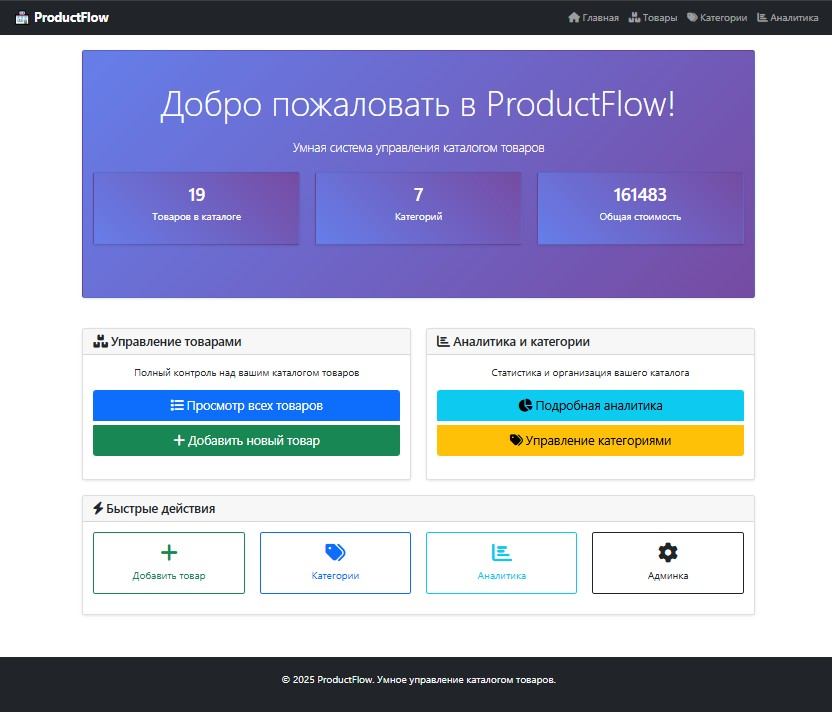
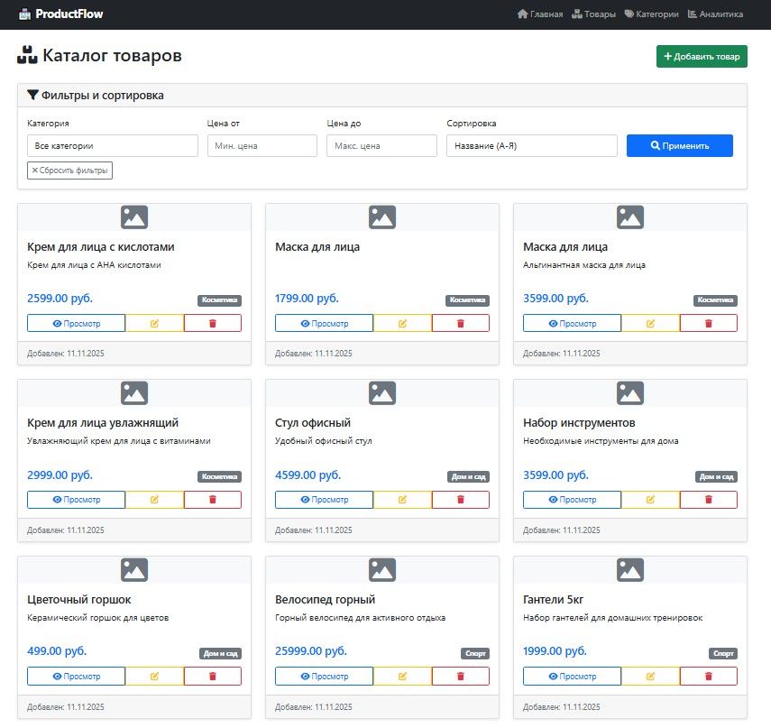
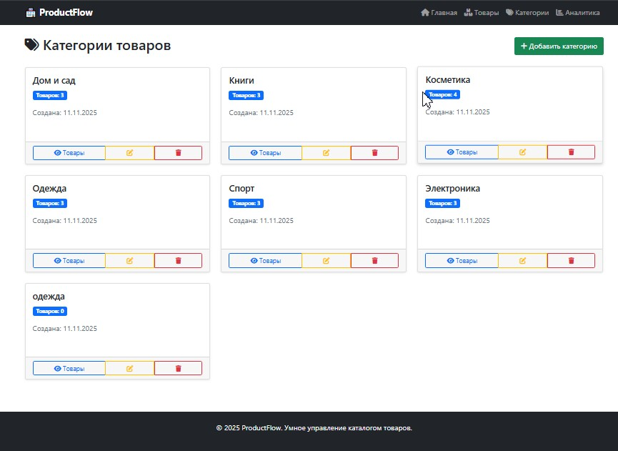
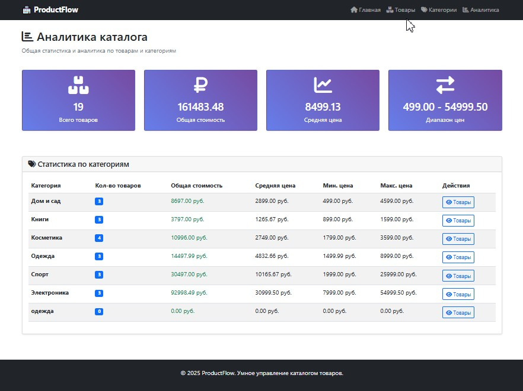
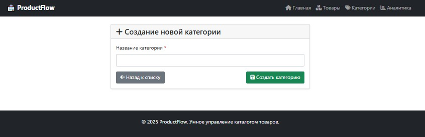

# 🏪 ProductFlow - Система управления каталогом товаров

<div align="center">


[🎥 Демонстрация](#-демонстрация)• [🚀 Возможности](#-возможности)• [🛠️ Установка](#️-установка)•[📁 Структура проекта](#-структура-проекта)• [🎯 Ключевые компоненты](#-ключевые-компоненты) • [📈 Примеры использования](#-примеры-использования) • [ 🎨 Особенности UI/UX](#-особенности-uiux)•[🔒 Валидация и безопасность](#-валидация-и-безопасность)• [🎯 Реализованные требования задания](#-реализованные-требования-задания)


Полнофункциональное Django-приложение для управления каталогами товаров с расширенными возможностями фильтрации, сортировки и аналитики.
</div>


## 🎥 Демонстрация

### 📱 Главная страница


*Обзорная панель с общей статистикой и быстрым доступом ко всем разделам*

### 📦 Страница товаров


*Каталог товаров с карточками, фильтрацией по категориям и цене, динамической сортировкой*

### 🏷️ Управление категориями


*Система категорий с количеством товаров и быстрыми действиями*

### 📊 Аналитическая панель


*Детальная аналитика с общей статистикой и метриками по категориям*

### ✨ Создание товара


*Интуитивная форма добавления товара с валидацией и загрузкой изображений*

### ✨ Создание категории


*Форма добавления категории*

### 🔍 Фильтрация в действии


*Умная фильтрация с автоматическим применением без перезагрузки страницы*

## 🚀 Возможности

### Основной функционал
- **Управление товарами**: Полный CRUD для товаров
- **Управление категориями**: Организация товаров по категориям
- **Поддержка изображений**: Загрузка и отображение изображений товаров
- **Валидация форм**: Комплексная проверка всех входных данных

### Расширенные возможности
- **Умная фильтрация**: Фильтрация по категориям и диапазону цен
- **Динамическая сортировка**: Сортировка по названию, цене и дате
- **Аналитика в реальном времени**: Статистика и аналитические данные
- **Адаптивный дизайн**: Мобильный интерфейс на Bootstrap

### Техническое совершенство
- **Django ORM**: Оптимизированные запросы с аннотациями и агрегатами
- **Динамические формы**: Автоотправка фильтров без перезагрузки страницы
- **Валидация моделей**: Проверка на уровне базы данных и форм
- **Наследование шаблонов**: Чистая, поддерживаемая структура шаблонов

## 📊 Аналитика и отчетность

- **Общая статистика**: Общее количество товаров, категорий и стоимость
- **Аналитика по категориям**: Количество товаров, общая стоимость, диапазоны цен
- **Анализ цен**: Средняя, минимальная и максимальная цены
- **Интерактивные графики**: Визуальное представление данных

## 🛠️ Установка

### Предварительные требования
- Python 3.8+
- Django 4.2+
- Pillow (для обработки изображений)

### Быстрый старт

1. **Клонируйте репозиторий**
```bash
   git clone https://github.com/your-username/productflow.git
   cd productflow
```
2. **Установите зависимости**
```
bash
pip install -r requirements.txt
```
3. **Выполните миграции**
```
bash
python manage.py makemigrations
python manage.py migrate
```
4. **Создайте суперпользователя (опционально)**
```
bash
python manage.py createsuperuser
```
5. **Добавьте тестовые данные (опционально)**
```
bash
python add_data.py
```
6. **Запустите сервер разработки**
```
bash
python manage.py runserver
```
7. **Откройте приложение**

- Основной сайт: http://127.0.0.1:8000/
- Админ-панель: http://127.0.0.1:8000/admin/

## 📁 Структура проекта
```
catalog_project/
├── catalog/                 # Основное приложение
│   ├── models.py           # Модели базы данных
│   ├── views.py            # Бизнес-логика
│   ├── forms.py            # Определения форм
│   ├── urls.py             # Маршрутизация URL
│   └── templates/catalog/  # HTML-шаблоны
├── templates/              # Базовые шаблоны
├── media/                  # Загружаемые файлы
├── static/                 # Статические файлы
└── catalog_project/        # Конфигурация проекта
```
## 🎯 Ключевые компоненты

### Модели

- **Product:** название, описание, цена, категория, изображение, временные метки
- **Category:** название, временные метки

### Представления

- **Класс-базированные представления:** Для операций списка, деталей, создания, обновления, удаления
- **Функция-базированные представления:** Для аналитики и пользовательского функционала
- **Миксины аутентификации:** Для защищенных операций

### Формы

- **ProductForm:** С валидацией цены и загрузкой изображений
- **CategoryForm:** Простое управление категориями
- **Формы фильтрации:** Динамическая фильтрация с автоотправкой


## 📈 Примеры использования

### Создание товара
1. Перейдите в "Товары" → "Добавить товар"
2. Заполните название, описание, цену, категорию
3. Загрузите изображение (опционально)
4. Отправьте форму с валидацией

### Фильтрация товаров
1. Используйте фильтры в боковой панели на странице товаров
2. Выберите категорию, диапазон цен или порядок сортировки
3. Формы автоматически отправляются при изменении

### Просмотр аналитики
1. Перейдите на страницу "Аналитика"
2. Посмотрите общую статистику
3. Изучите аналитику по категориям
4. Сортируйте данные по различным метрикам

## 🎨 Особенности UI/UX
- Эффекты при наведении: Интерактивные анимации карточек
- Адаптивная сетка: Подстраивается под все размеры экранов
- Компоненты Bootstrap: Современный, последовательный дизайн
- Динамическая навигация: Интуитивная структура меню
- Сообщения-уведомления: Обратная связь пользователю о действиях

## 🔒 Валидация и безопасность
- Валидация цены: Запрещает отрицательные значения
- Обязательные поля: Обеспечивает полноту данных
- HTML5 валидация: Проверка ввода на уровне браузера
- Django CSRF: Защита от межсайтовой подделки запросов

## 📝 API endpoints
```
Метод	URL	Описание
GET	/	Главная страница с обзором
GET	/products/	Список товаров с фильтрами
POST	/products/create/	Создать новый товар
GET	/products/<id>/	Детали товара
POST	/products/<id>/update/	Обновить товар
POST	/products/<id>/delete/	Удалить товар
GET	/categories/	Список категорий
GET	/analytics/	Статистика и отчеты
```
## 🎯 Реализованные требования задания

### ✅ Базовый CRUD
- Полное управление товарами и категориями
- Формы создания и редактирования с валидацией
- Подтверждение удаления

### ✅ Расширенная функциональность
- Фильтрация по категориям и ценам
- Сортировка по различным параметрам
- Динамические формы без перезагрузки

### ✅ Аналитика и агрегаты
- Общая стоимость товаров
- Статистика по категориям
- Средние, минимальные и максимальные цены
- Количество товаров в категориях

### ✅ Дополнительные функции
- Загрузка изображений товаров
- Адаптивный дизайн Bootstrap
- Качественный код с комментариями

## 🤝 Участие в разработке
- Сделайте форк репозитория
- Создайте ветку для функции (git checkout -b feature/amazing-feature)
- Зафиксируйте изменения (git commit -m 'Add amazing feature')
- Отправьте в ветку (git push origin feature/amazing-feature)
- Откройте Pull Request

## 📄 Лицензия
Этот проект лицензирован по лицензии MIT - смотрите файл LICENSE для деталей.

## 🙏 Благодарности
- Фреймворк Django и его сообщество
- Bootstrap за адаптивный дизайн
- Font Awesome за иконки
- Pillow за поддержку обработки изображений

## 👥 Автор
Разработчик - BizziBerry


<div align="center">
Разработано с ❤️ на Django
⭐ Если вам понравился проект, не забудьте поставить звезду!

</div>
